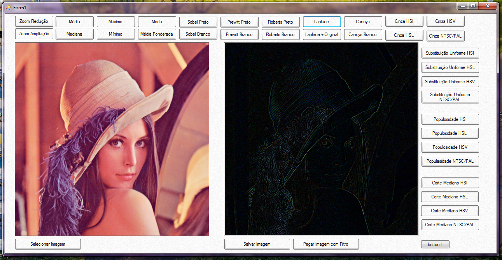

## Trabalho – Processamento de Imagens  

### Filtros de Suavização
 - Média  
 - Média Ponderada
 - Mediana  
 - Moda  
 - Máximo
 - Mínimo

### Detectores de Borda
- Sobel
- Prewitt
- Roberts
- Laplace
- Cannys

#### Máscara utilizada em Sobel  
|    |  x |    |     |    |  y |    |
|:--:|:--:|---:|----:|:--:|:--:|:--:|
| -1 | -2 | -1 |     | -1 |  0 |  1 |
|  0 |  0 |  0 |     | -2 |  0 |  2 |
|  1 |  2 |  1 |     | -1 |  0 |  1 |  

#### Máscara utilizada em Prewitt  
|    |  x |    |     |    |  y |    |
|:--:|:--:|:--:|----:|:--:|:--:|:--:|
| -1 | -1 | -1 |     | -1 |  0 |  1 |
|  0 |  0 |  0 |     | -1 |  0 |  1 |
|  1 |  1 |  1 |     | -1 |  0 |  1 |  

#### Máscara utilizada em Roberts  
|  x |    |    |    |  y |
|:---|:--:|---:|:--:|:--:|
|  1 |  0 |    |  0 |  1 |
|  0 | -1 |    | -1 |  0 |

#### Máscara utilizada em Laplace
| 0 | 1 | 0 |
|:-:|:-:|:-:|
| 1 |-4 | 1 |
| 0 | 1 | 0 |

#### Máscara utilizada em Cannys
| 0 | 1 | 0 |
|:-:|:-:|:-:|  
| 1 |-4 | 1 |
| 0 | 1 | 0 |  

e (R + G + B)/3 (escala de cinza)

### Escala de Cinza  
- Modelo NTSC_YIQ e PAL_YUV
  - Y = (( 0.299*R)+( 0.587*G) +( 0.114*B))
- Modelo HSV
  - V = max(R,G,B)
- Modelo HSL
  - L = (max(R,G,B) + min(R, G, B))/2
- Modelo HSI
  - I = (R + G + B)/3

#### Outras Funcionalidades
- Zoom de Redução
- Zoom de Ampliação
- Método de Quantização
  - Substituição Uniforme
  - Algoritmo Populoso
  - Algoritmo de Corte Mediano

#### Imagem da Tela do Programa

